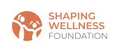

<!-- PROJECT LOGO -->
 

  

<h1 align="center">Shaping Wellness Foundation</h1>

  

  We strive to cultivate a generation of resilient and confident young women equipped with the tools and knowledge to prioritize their health and well-being, ultimately building stronger, healthier communities.
     
     
    <a href="https://github.com/jayc-gh/Shaping-Wellness"><strong>Check out our website »</strong></a>
  

<!-- TABLE OF CONTENTS -->

  
Table of Contents

  <ol>
    <li>
      <a href="#about-the-project">About The Project</a>
      <ul>
        <li><a href="#built-with">Built With</a></li>
      </ul>
    </li>
    <li><a href="#improvements">Future improvements</a></li>
    <li><a href="#contact">Contact</a></li>
  </ol>

<!-- ABOUT THE PROJECT -->

## Who we are

Shaping Wellness Foundation is a new nonprofit dedicated to
            supporting the health, well-being, and personal growth of young girls in underserved communities.
             While our programs are still taking shape, our commitment is grounded in transparency, research, and community input.  We're
            focused on building inclusive, thoughtful initiatives that help
            girls develop confidence, stay active, and make informed choices for
            lifelong wellness. 

(<a href="#readme-top">back to top</a>)

## Built With

- [![Next][Next.js]][Next-url]
- [![React][React.js]][React-url]
- [![Stripe.js][Stripe.js]][Stripe-url]
- [![Supabase][Supabase]][Supabase-url]

(<a href="#readme-top">back to top</a>)

<!-- CONTACT -->

## Contact

Luciana Gearing [Founder] - email  
Brenda Narvaez [Designer] - brenda.narvaez28@gmail.com | [LinkedIn](https://www.linkedin.com/in/brenda-narvaez)  
Jay Cho [Developer] - jaycho1017@gmail.com | [LinkedIn](https://www.linkedin.com/in/jaycho1017/)

(<a href="#readme-top">back to top</a>)

[forks-shield]: https://img.shields.io/github/forks/github_username/repo_name.svg?style=for-the-badge
[forks-url]: https://github.com/github_username/repo_name/network/members
[stars-shield]: https://img.shields.io/github/stars/github_username/repo_name.svg?style=for-the-badge
[stars-url]: https://github.com/github_username/repo_name/stargazers
[issues-shield]: https://img.shields.io/github/issues/github_username/repo_name.svg?style=for-the-badge
[issues-url]: https://github.com/github_username/repo_name/issues
[license-shield]: https://img.shields.io/github/license/github_username/repo_name.svg?style=for-the-badge
[license-url]: https://github.com/github_username/repo_name/blob/master/LICENSE.txt
[linkedin-shield]: https://img.shields.io/badge/-LinkedIn-black.svg?style=for-the-badge&logo=linkedin&colorB=555
[linkedin-url]: https://linkedin.com/in/linkedin_username
[Next.js]: https://img.shields.io/badge/next.js-000000?style=for-the-badge&logo=nextdotjs&logoColor=white
[Next-url]: https://nextjs.org/
[React.js]: https://img.shields.io/badge/React-20232A?style=for-the-badge&logo=react&logoColor=61DAFB
[React-url]: https://reactjs.org/
[Stripe.js]: https://img.shields.io/badge/Stripe-635bff?style=for-the-badge&logo=stripe&logoColor=white
[Stripe-url]: https://stripe.com
[Supabase]: https://img.shields.io/badge/Supabase-3ECF8E?style=for-the-badge&logo=supabase&logoColor=white
[Supabase-url]: https://supabase.com
